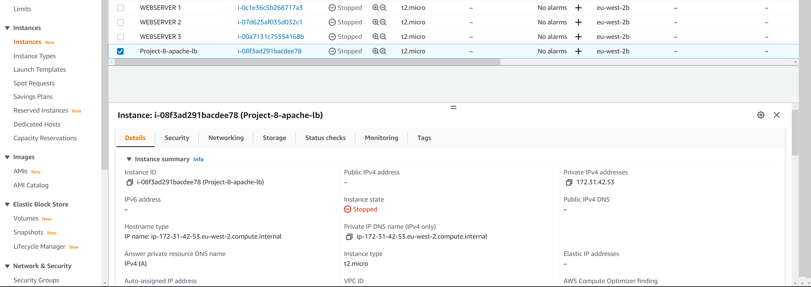
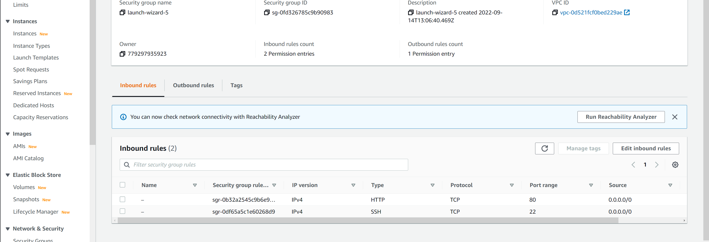
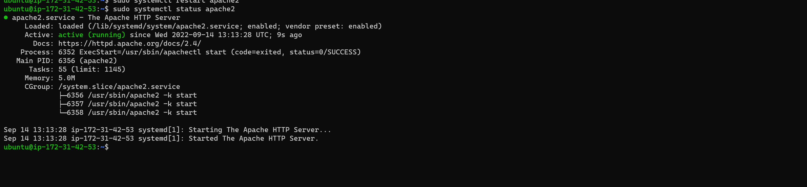
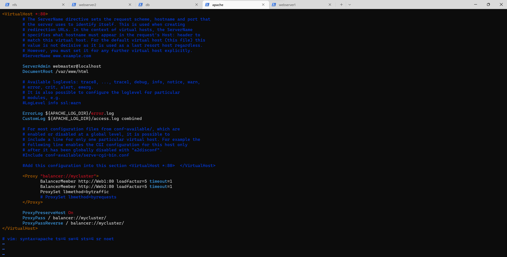
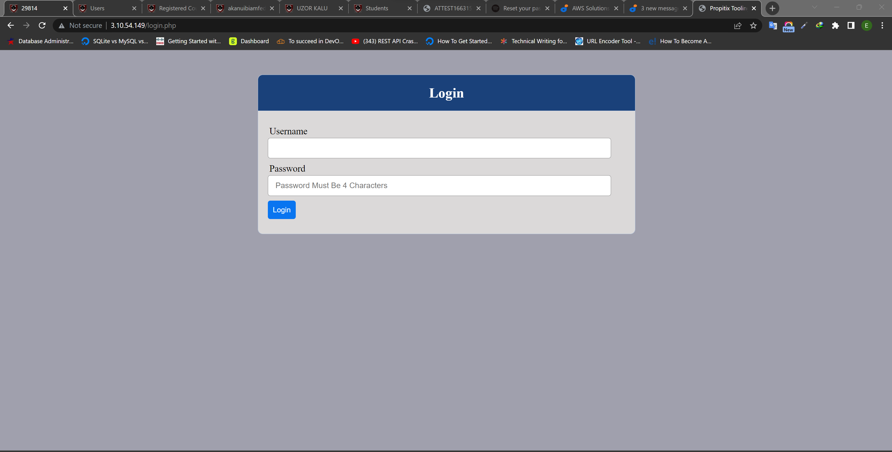
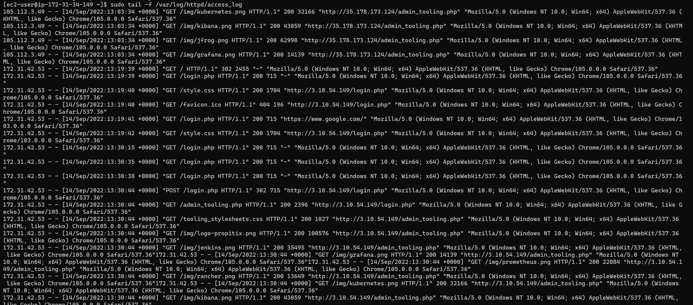
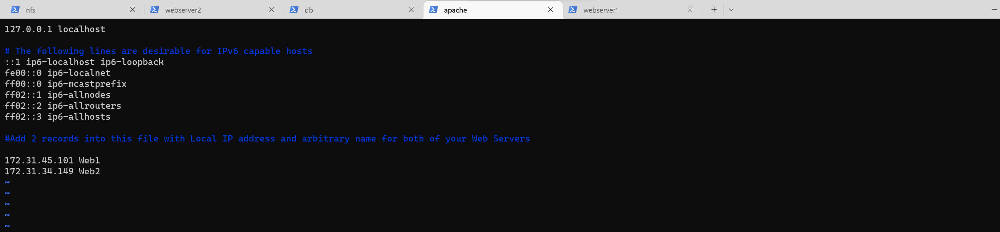
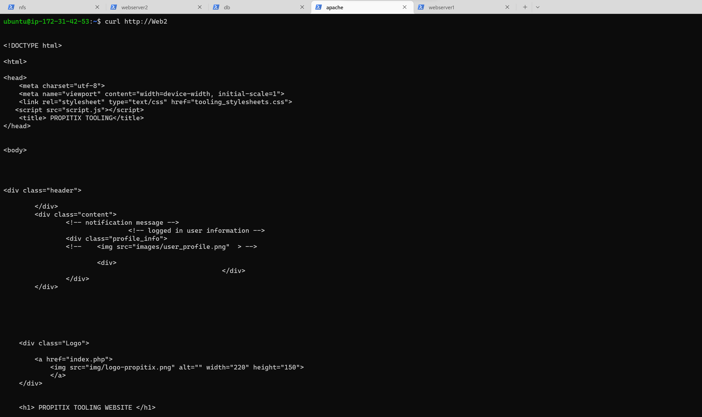

# Project-8

# Load Balancer Solution With Apache

The pre requisite configuration is the completing of Project 7 and making sure that all the webservers are connected to the db servers and also have there website hosted on the NFS Server. It must also be ensure that the Public IP address of all three Webservers can access the propitix Website on the browser.

## Configure Apache As A Load Balancer

Firstly spin up a Ubuntu Server Instance on AWS EC2 that will serve as the Apache Server used for Load Balancer and name it Project-8-apache



Open Port 80 as an inbound rule under the Security group of the server instance



### Install Apache Load Balancer on Project-8-apache-lb server and configure it to point traffic coming to LB to both Web Servers

Copy the code below line by line to install the apache on the server 

```
sudo apt update
sudo apt install apache2 -y
sudo apt-get install libxml2-dev
```

Then enable some modules by coping the code underneath line by line and run the code

```
sudo a2enmod rewrite
sudo a2enmod proxy
sudo a2enmod proxy_balancer
sudo a2enmod proxy_http
sudo a2enmod headers
sudo a2enmod lbmethod_bytraffic
```

Restart apache2 service

`sudo systemctl restart apache2`

`sudo systemctl status apache2`




### Configure load balancing

Edit the configuration file by typing the code below

`sudo vi /etc/apache2/sites-available/000-default.conf `

Copy the configuration underneath into the file and save it

```

#Add this configuration into this section <VirtualHost *:80>  </VirtualHost>

<Proxy "balancer://mycluster">
               BalancerMember http://<WebServer1-Private-IP-Address>:80 loadfactor=5 timeout=1
               BalancerMember http://<WebServer2-Private-IP-Address>:80 loadfactor=5 timeout=1
               ProxySet lbmethod=bytraffic
               # ProxySet lbmethod=byrequests
        </Proxy>

        ProxyPreserveHost On
        ProxyPass / balancer://mycluster/
        ProxyPassReverse / balancer://mycluster/
```
 

Then restart the apache server

`sudo systemctl restart apache2`

### Verify if the configuration work

Access the public address of the Load Balancer Server on the browser to check if the configuration works. If it works, it will load the Propitix Login Page




Then unmount the /var/log/httpd from the NFS Server /mnt/apps to check the log and see the log of each webserver to know how they response to the load balancer

`sudo umount /var/log/httpd/`

On each of the webserver, type the following code and see how they response to the website loading

`sudo tail -f /var/log/httpd/access_log`



### Configuring Nameserver for the Loadbalancer using Web1 for Webserver 1 and Web2 for Webserver 2

`sudo vi /etc/hosts`

Then copy the following under it

```
#Add 2 records into this file with Local IP address and arbitrary name for both of your Web Servers

<WebServer1-Private-IP-Address> Web1
<WebServer2-Private-IP-Address> Web2
```
 

Then go to edit the apache config file to change the webserver private ipaddress to the name in the hosts file


`sudo vi /etc/apache2/sites-available/000-default.conf`


Change the Private Ip Address of Webserver 1 into Web1 and Webserver 2 into Web2

 

You can try to curl your Web Servers from LB locally curl http://Web1 or curl http://Web2 on the LB server terminal

 